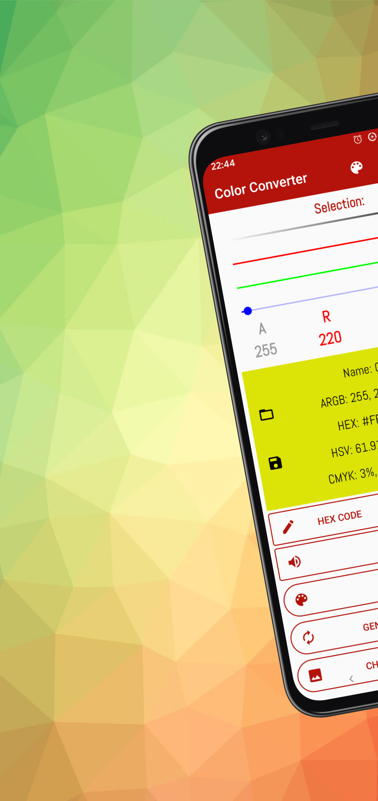
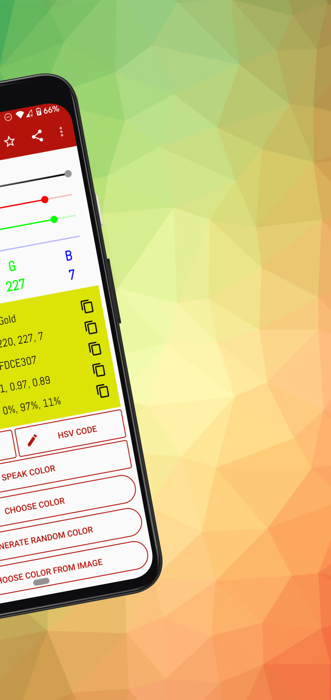
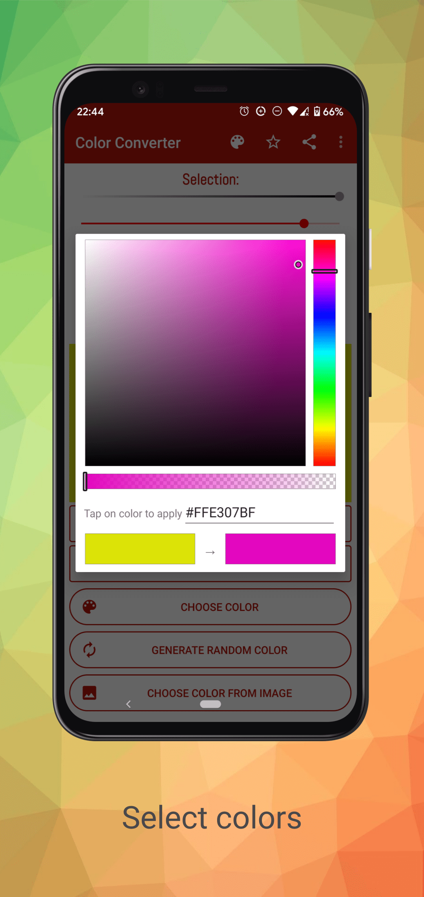
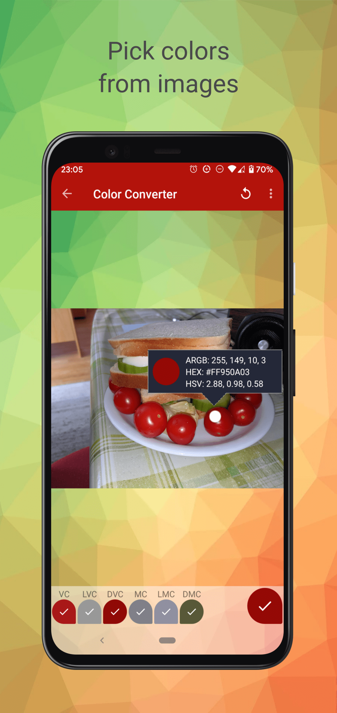
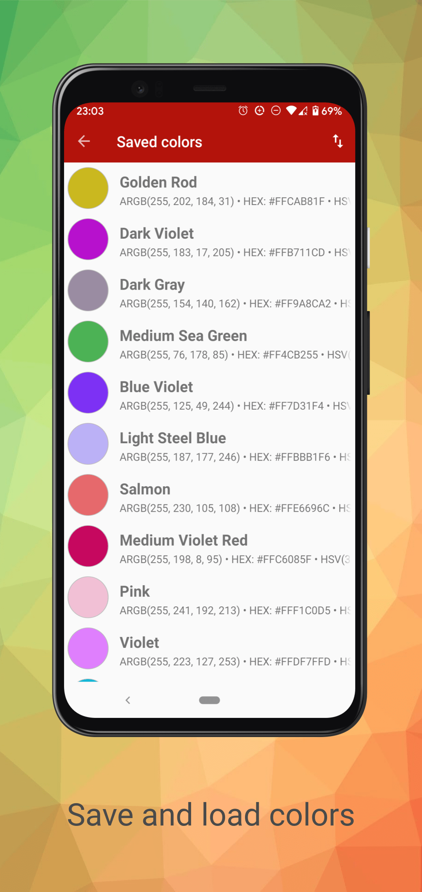
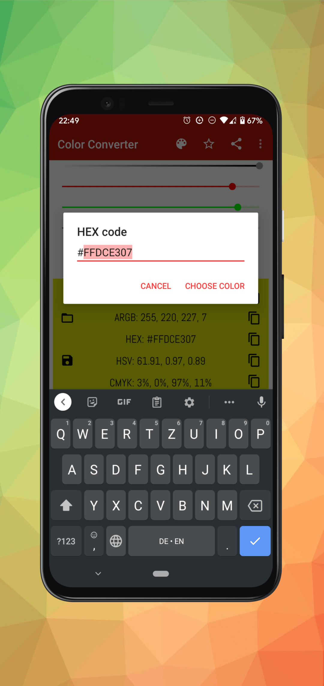

## Color Converter

Color Converter is an Android app to pick, display and convert colors.

Download Color Converter from [Google Play](https://play.google.com/store/apps/details?id=com.mrgames13.jimdo.colorconverter)!

More information on the projects website: [https://chillibits.com/colorconverter](https://chillibits.com/colorconverter)

## Features
-   Pick colors
-   Get name of picked colors
-   Display picked colors in different formats (ARGB, HEX, HSV, CMYK)
-   Generate random colors
-   Pick colors from a predefined color palette
-   Pick color from a photo / image
-   Save / load colors
-   Export saved colors to Adobe color exchange formats (ACO / ASE)
-   Copy colors to clipboard
-   Dark mode

## Screenshots (Android 11)
  
  

## Contribute to this project
You can contribute to this project by doing following things:
-   If you want to contribute new features, please fork this repository to your own GitHub account. Then build your awesome feature and open a pull request back to this repo. We will check your changes and merge your contribution asap.
-   If you want to add a new translation language or improve an existing translation, please write an email to: [contact@chillibits.com](mailto:contact@chillibits.com&subject=Add%20translation)
-   If you want to submit a request for a new feature, please [open an issue on GitHub](https://github.com/ChilliBits/color-converter/issues/new).

## Used third party libraries
Thanks to following people:
-   [ColorPickerPreference](https://github.com/attenzione/android-ColorPickerPreference) by Sergey Margaritov
-   [PixImagePicker](https://github.com/akshay2211/PixImagePicker) by Akshay Sharma
-   [ColorPickerView](https://github.com/skydoves/ColorPickerView) by Jaewoong Eum
-   [AndroidIconics](https://github.com/mikepenz/Android-Iconics) by Mike Penz
-   [MaterialStyledDialogs](https://github.com/javiersantos/MaterialStyledDialogs) by Javier Santos
-   [FiveStarMe](https://github.com/numerative/Five-Star-Me) by Michael Hathi
-   [SimpleSettings](https://github.com/marcauberer/simple-settings) by Marc Auberer
-   [AdobeColorTool](https://github.com/marcauberer/adobe-color-tool) by Marc Auberer

Thanks to all contributors and translators!

© ChilliBits 2017-2022 (Designed and developed by Marc Auberer)
